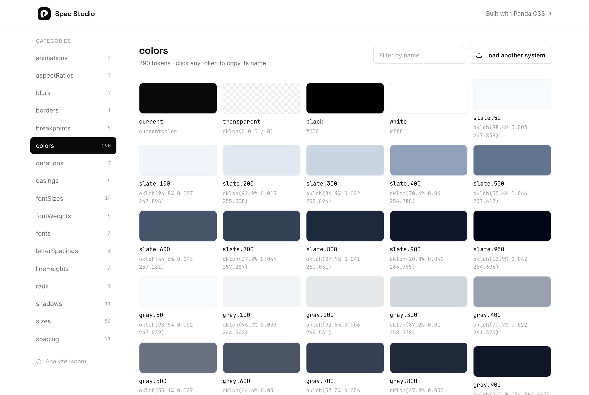
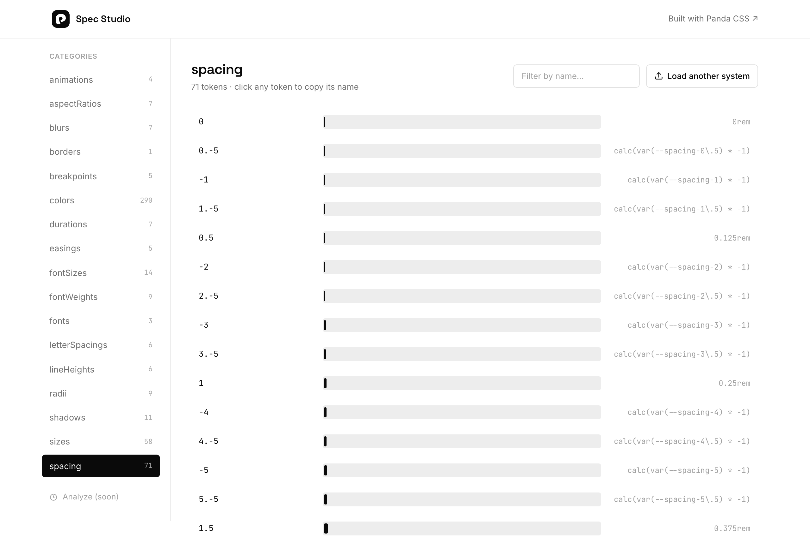
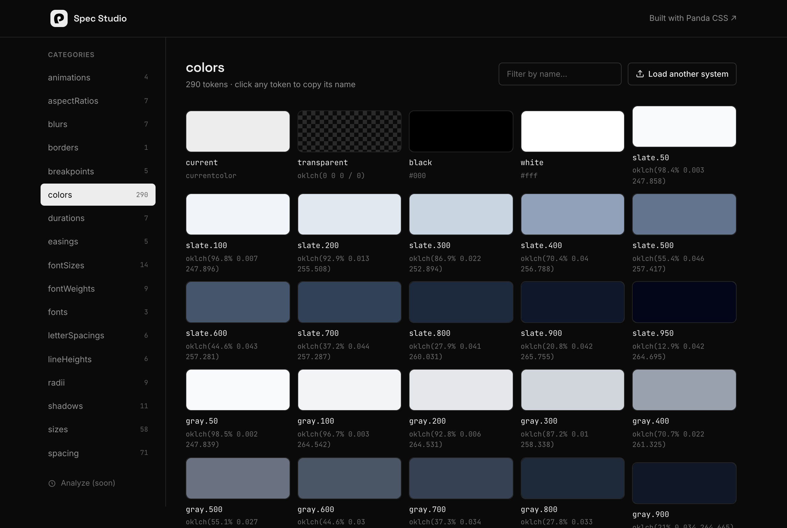

# Panda Studio

Bring your Panda CSS design system and instantly **see** it — colors, spacing, type, radii, shadows — rendered straight from the JSON Panda emits. No install, no server, no account. Drop a file or paste JSON; it renders.



## Get your `tokens.json`

Run `panda codegen` in any Panda project, then grab the file it writes:

```
styled-system/specs/tokens.json
```

Drop that file (or your whole `styled-system/` folder) onto the app — or paste its contents, or hit **Load sample** to see it work with the Panda preset.

## Develop

This app lives in the Panda monorepo but pins the **published** `@pandacss/*` betas rather than the workspace
sources — `@pandacss/compiler-wasm` and `@pandacss/dev` need a Rust toolchain to build from source, which deploy
builders don't have. From the repo root:

```bash
pnpm install
pnpm --filter studio dev       # Nuxt dev server
pnpm --filter studio build     # prisma generate + panda codegen + nuxt build
pnpm --filter studio generate  # panda codegen + nuxt generate → static site
```

## Deploy

Deployed to Vercel as **panda-studio-v2** off the `v2` branch, with root directory `apps/studio` and build command
`cd ../../ && pnpm --filter studio build`. Pushing to `v2` deploys automatically; to deploy by hand:

```bash
pnpm --filter studio run deploy          # production
pnpm --filter studio run deploy:preview  # preview URL
```

Note the `run` — `pnpm deploy` on its own is a pnpm builtin and will not reach this script. Both upload from the repo
root (the build command needs the workspace) and pin the project by id, so the repo-root `.vercel` link — which points
at the docs project — can't be picked up by accident. Needs the Vercel CLI on your PATH and `vercel login`.

Sharing a spec (`/s/:slug`) writes to Postgres through Prisma, so the app needs the Node server — `build`, not
`generate`. `generate` still produces a static `.output/public` if you only want the viewer without sharing.

Environment variables:

- `DATABASE_URL` — Postgres connection string. Shared with the playground's database, so it **must** carry a
  distinct `?schema=` qualifier; `prisma db push` diffs the whole schema and would otherwise drop the playground's
  tables.
- `NUXT_PUBLIC_SITE_URL` — public origin, used for canonical and OG URLs. Relative URLs are emitted without it.

## What it does

- **Renders every category** with a view that fits it: colors & gradients → swatch grid, spacing/sizes/radii → a sorted scale, fonts → specimens, fontSizes/lineHeights/letterSpacings/fontWeights → a type ramp, shadows/borders → sample boxes, aspectRatios → boxes at that ratio, blurs → a blur ramp, durations/easings/animations → live animated chips, everything else → a clean name/value table.
- **Any Panda `tokens.json`**, not just the bundled sample — drop your own system and its categories render by type. (A dropped system's custom `@keyframes` aren't in the spec, so those animation chips render static; the standard `spin/ping/pulse/bounce` play.)
- **Search** filters the active category; **click any token** to copy its `name` (what you'd type in `css({ ... })`).
- **Light + dark** and discovered theme/variant switching, so semantic `var()` tokens paint their real colors.
- **Share** a system as a link — the tokens (and, from Analyze, the usage snapshot) are saved server-side and open read-only at `/s/<slug>` (and `/a/<slug>` for the analysis). No account.
- **Persists** your last-loaded system in IndexedDB, so a refresh keeps it.
- Bad JSON shows a clear inline error, never a blank screen.

<p>
  
  
</p>

## Stack

Nuxt 3 + Vue 3, [Panda CSS](https://panda-css.com) (workspace `@pandacss/*`), [Ark UI](https://ark-ui.com) for accessible primitives (tabs, file upload, clipboard, fields).

## Analyze usage

The rail's **Analyze usage** link answers: which of my tokens are actually used? Drop your source files (or the whole repo folder) and it reports, per category, which tokens are **used / unused / hot**.

There are two tiers, and the drop decides which one runs:

- **Compiler-grade** — include your `panda.config.ts` in the drop and the real Panda compiler runs in your browser via `@pandacss/compiler-wasm`. Same extraction and token resolution as a build, so bare-numeric tokens (`spacing.4`) and everything else are counted exactly.
- **Heuristic** — no config in the drop, so a name-match scan runs instead. Accurate for named tokens (`red.500`, counting both `'red.500'` and `token('colors.red.500')`), approximate for bare-numeric ones. The badge on the report says which tier you got.

Both stay in the browser — nothing is uploaded unless you press **Share**. Sharing an analysis carries the usage snapshot with it, so `/a/<slug>` shows the same report you saw.
