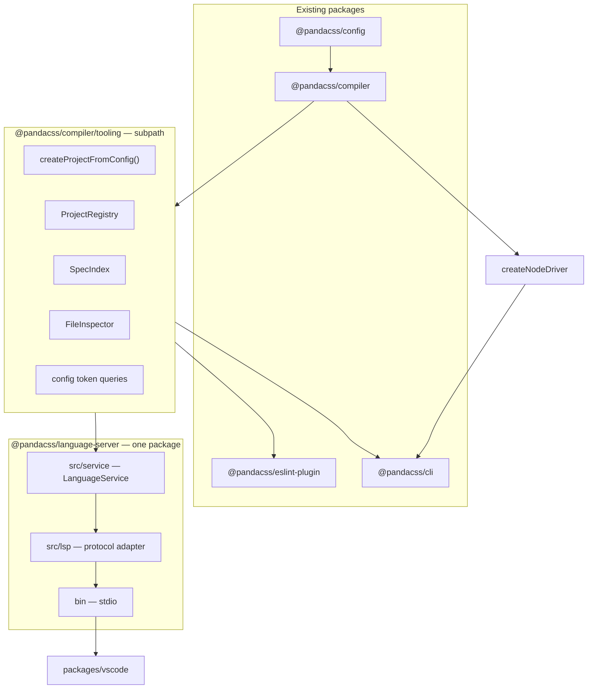

# Language service implementation

Ship editor intelligence inside the panda-v2 monorepo with **two new surfaces** only:

1. **`@pandacss/compiler/tooling`** — subpath on the existing compiler package (not a new npm package)
2. **`@pandacss/language-server`** — query API + LSP stdio binary in one package
3. **`packages/vscode`** — VS Code extension (Marketplace; not an npm library users import)

No `@pandacss/toolkit`. No `@pandacss/language-service`. No `@pandacss/project`.

Product rationale: [Config authoring language service](./config-authoring-language-service.md).

## Goals

- Preset-aware completions, hover, and diagnostics while editing `panda.config.*`
- Same token-path validation in the editor and in CI (`panda doctor`)
- `panda-language-server --stdio` on npm for Neovim, Helix, Zed, etc.
- VS Code extension in-repo: Marketplace + Open VSX
- ESLint, LSP, and CLI config checks share **`@pandacss/compiler/tooling`** — already a dependency everywhere

## Package budget

| Surface | New? | Role |
| ------- | ---- | ---- |
| `@pandacss/compiler/tooling` | Subpath only | Registry, spec index, inspect cache, config token queries |
| `@pandacss/language-server` | **New package** | `LanguageService` + LSP adapter + `panda-language-server` bin |
| `packages/vscode` | **New folder** | VS Code client + VSIX publish |
| `@pandacss/eslint-plugin` | Existing | Rules; core → `compiler/tooling` |
| `@pandacss/cli` | Existing | Build → `createNodeDriver`; config check → `compiler/tooling` |

Everything else stays where it is today.

## Architecture

### Two lifecycles, one load primitive

| Lifecycle | Entry | Used by |
| --------- | ----- | ------- |
| **Build driver** | `createNodeDriver()` | CLI build/watch, codegen, analyze, MCP |
| **Query registry** | `ProjectRegistry` in `compiler/tooling` | ESLint, language-server, CLI doctor |

Both use the same helper: `loadConfig` → `createCompilerFromSnapshot` → `hydrateDesignSystem`. Extract
`createProjectFromConfig()` from `driver.ts` into `compiler/src/tooling/`; Driver and registry both call it.



### Dependency rules

```txt
@pandacss/compiler/tooling     host-agnostic; no ESLint, no LSP imports
        ↓
├─ eslint-plugin               ESLint settings → registry
├─ cli doctor                  config token validation
└─ language-server/service     cursor + completions (uses tooling)

language-server/lsp            vscode-languageserver only; no Panda logic
        ↓
packages/vscode                spawn server, settings, trust, decorators
```

**Rejected:** separate `toolkit`, `language-service`, and `project` packages — same boundaries, three extra publishes.

### One index, one config-token validator

- **SpecIndex** — from `compiler.spec()`; shared by eslint rules and completions
- **Config token queries** — in `compiler/tooling`; language-server and CLI doctor import the same functions

App-file tokens stay on `compiler.inspectFile` → `tokenRefs` (eslint). Phase 1 does not add a second app-file path.

## `@pandacss/compiler/tooling`

Subpath export on the existing compiler package. ESLint and CLI already depend on `@pandacss/compiler`; no new
 transitive dependency for them.

```txt
packages/compiler/src/tooling/
  create-project.ts      shared with driver.ts
  registry.ts            ProjectRegistry
  spec-index.ts            SpecIndex from compiler.spec()
  inspector.ts             FileInspector (from eslint-plugin)
  config-tokens.ts         find/complete/validate {token.path} in config text
  resolve.ts               discover configs, map file → config
```

**`package.json` export:**

```json
"./tooling": {
  "source": "./src/tooling/index.ts",
  "types": "./dist/tooling/index.d.ts",
  "default": "./dist/tooling/index.js"
}
```

Add `src/tooling/index.ts` to the compiler `tsup` build entry.

### `ProjectRegistry`

Replaces eslint-plugin `ProjectCache`. Backs language-server workspace handling.

```ts
interface ProjectRegistry {
  discover(workspaceRoot: string): Promise<string[]>
  resolveConfigForFile(filePath: string): string | undefined
  getProject(key: { cwd: string; configPath?: string }): Promise<PandaProject>
  invalidate(changedPaths: string[]): void
}
```

Discovery/matching: same rules as [lint-plugins](./lint-plugins.md). Cache by `(cwd, configPath)`. Debounce invalidation
(~300ms) in LSP; eslint batch mode skips debounce.

### Config token queries

```ts
function findConfigTokenRefs(source: string, spec: SpecIndex): ConfigTokenRef[]
function completeConfigTokenPath(prefix: string, spec: SpecIndex): string[]
```

No TypeScript typechecker — string/AST scan around cursor spans.

## `@pandacss/language-server`

One package, two layers inside it:

| Layer | Path | Depends on |
| ----- | ---- | ---------- |
| **Service** | `src/service/` | `@pandacss/compiler/tooling` only |
| **LSP** | `src/lsp/` | service + `vscode-languageserver` |

```txt
packages/language-server/
  src/service/           LanguageService — completions, diagnostics, hover, definition
  src/lsp/               stdio transport, capabilities, LSP type mapping
  bin/panda-language-server.js
```

**Service API** (no LSP types):

```ts
interface LanguageService {
  getCompletions(input: DocumentQuery): CompletionItem[]
  getDiagnostics(input: DocumentQuery): Diagnostic[]
  getHover(input: DocumentQuery): Hover | null
  getDefinition(input: DocumentQuery): Location | null
}
```

**Routing:**

1. `ProjectRegistry.resolveConfigForFile(file)`
2. Config file → `tooling/config-tokens` + SpecIndex
3. App file (phase 4) → FileInspector + `suggestTokens`

**LSP layer** maps service types ↔ `vscode-languageserver`. No completion or diagnostic logic in `src/lsp/`.

**Optional export** `@pandacss/language-server/service` for tests or programmatic use — same code the bin runs.

**Capabilities (phase 1):** completion, hover, publishDiagnostics.

**Capabilities (phase 4):** documentColor, inlayHint (extension middleware where needed).

## VS Code extension

`packages/vscode` — `panda-css-vscode` on Marketplace.

- Spawn bundled `panda-language-server --stdio`
- Sync `panda.*` settings; workspace trust
- Commands: restart server, open config, show output
- [VS Code publishing](#vs-code-publishing) — separate from npm changesets

## VS Code publishing

1. Build `language-server` + vscode client
2. Stage `dist/` (esbuild; no `workspace:*` in artifact)
3. Copy per-platform compiler native into `dist/node_modules/`
4. `vsce package --no-dependencies --target <platform>` per matrix row
5. `pnpm release:vscode` → Marketplace + Open VSX

**Matrix:** `darwin-arm64`, `darwin-x64`, `linux-x64`, `linux-arm64`, `win32-x64`.

Server ships inside the VSIX — users do not install `@pandacss/language-server` separately for VS Code.

## Other editors

```lua
require('lspconfig').panda.setup({
  cmd = { 'panda-language-server', '--stdio' },
  filetypes = { 'typescript', 'typescriptreact', 'javascript', 'javascriptreact' },
  root_dir = require('lspconfig.util').root_pattern('panda.config.{ts,js,mjs,cjs}'),
})
```

## CI parity

| Surface | Config invalid `{colors.x}` | App invalid token |
| ------- | --------------------------- | ----------------- |
| Language server (editor) | Warning (configurable) | Phase 4 |
| `panda doctor` | Error | N/A |
| `@pandacss/eslint-plugin` | N/A initially | Error / warn |

Validation logic: **`@pandacss/compiler/tooling`** only. Severity differs by host.

## Phased rollout

### Phase 0 — `compiler/tooling`

- [ ] `packages/compiler/src/tooling/` + `./tooling` export
- [ ] `createProjectFromConfig` — refactor out of `driver.ts`
- [ ] `ProjectRegistry`, `SpecIndex`, `FileInspector`
- [ ] Refactor eslint-plugin to import from `@pandacss/compiler/tooling`
- [ ] Vitest in `packages/compiler` for tooling

**Done when:** eslint-plugin tests unchanged; registry resolves preset tokens from a fixture config.

### Phase 1 — Config queries + service

- [ ] `config-tokens.ts` in tooling
- [ ] `language-server/src/service/` config routing
- [ ] CLI `doctor` uses tooling for config token refs

**Done when:** service completes `colors.red.500` in `panda.config.ts` without generated types.

### Phase 2 — LSP + npm

- [ ] `language-server` LSP layer + bin
- [ ] Publish `@pandacss/language-server`
- [ ] Neovim doc on website

**Done when:** `panda-language-server --stdio` works in a generic LSP client.

### Phase 3 — VS Code

- [ ] `packages/vscode` + platform matrix + `release:vscode`
- [ ] Deprecate standalone `panda-vscode` repo

### Phase 4 — App files

- [ ] Service routes app files through FileInspector + suggest APIs

### Phase 5 — Optional

- [ ] TS plugin for tsserver dedupe
- [ ] buildinfo in SpecIndex
- [ ] Inlay hints

## Testing

| Layer | Where |
| ----- | ----- |
| Tooling | `packages/compiler` Vitest |
| ESLint | `packages/eslint-plugin` (unchanged assertions) |
| Service | `packages/language-server` Vitest (no LSP) |
| LSP | `packages/language-server` integration harness |
| VS Code | `@vscode/test-electron` smoke |
| CLI | doctor fails on bad config token |

## Open questions

- stdio vs IPC for VS Code — stdio first
- Config typo severity in editor: warning vs error
- Wasm fallback in VSIX when no native prebuild matches

## Related

- [Config authoring language service](./config-authoring-language-service.md)
- [Panda lint plugins](./lint-plugins.md)
- [Config loading](./config-loading-design.md)
- [CLI v2 direction](./cli.md)
- [Output and host layer](./output-and-host-layer.md)
