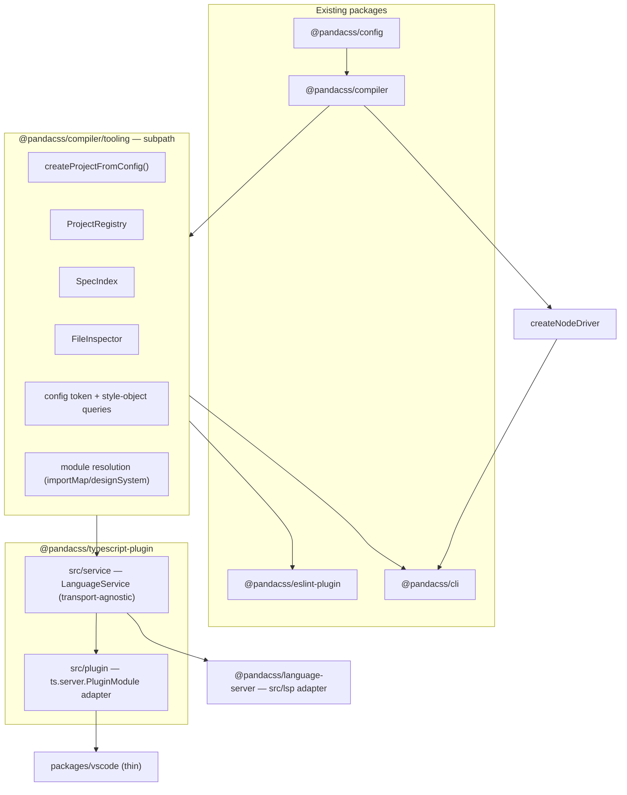

# Language service implementation

Ship editor intelligence inside the panda-v2 monorepo, **two thin transports over one core, built together**:

1. **`@pandacss/compiler/tooling`** — subpath on the existing compiler package (not a new npm package)
2. **`@pandacss/typescript-plugin`** — hosts the transport-agnostic `LanguageService` core, plus a classic
   `ts.server.PluginModule` adapter for Strada-based `tsserver` (VS Code today, most editors)
3. **`@pandacss/language-server`** — thin LSP transport (`vscode-languageserver`) over the same core, for
   `tsgo --lsp` / TypeScript 7 (Corsa) and any generic LSP client
4. **`packages/vscode`** — thin extension that registers the plugin via `contributes.typescriptServerPlugins`
   (Marketplace; not an npm library users import)

No `@pandacss/toolkit`. No `@pandacss/language-service`. No `@pandacss/project`.

Product rationale: [Config authoring language service](./config-authoring-language-service.md).

## Revised: both transports ship in Phase 1, not sequentially

The original plan was TS-plugin-first, LSP deferred until non-TS-native template files (Vue/Svelte/Astro) forced it.
That's revised as of 2026-07-03: **TypeScript 7.0 (codename Corsa / `tsgo`) is in RC with GA targeted mid-to-late July
2026, and it does not support the classic Strada plugin API** — `ts.server.PluginModule`'s
`Object.create(info.languageService)` proxy trick only works because a plugin runs in the same JS process as tsserver
and can monkey-patch its object graph. That's structurally impossible against a Go binary. Corsa's own plugin story is
unspecified ("planned, IPC-based, WIP"); its actual shipped interface is `tsgo --lsp`. Microsoft is consolidating the
new implementation around LSP, not the classic in-process plugin model our original argument depended on.

This doesn't invalidate the plugin — Strada-based tsserver has real ecosystem inertia (Vue, Svelte, styled-components
all depend on it) and won't disappear the day Corsa GAs. But building only the classic adapter now means betting the
whole editor story on an API surface Microsoft has already said the new implementation won't carry forward, with no
defined timeline for whatever replaces it. Since the `LanguageService` core was already designed to be
transport-agnostic for exactly this kind of pivot, the hedge is cheap: build the classic plugin adapter **and** the
LSP adapter in Phase 1, both thin wrappers over the same core. Whichever way the ecosystem tips, Panda's editor
intelligence keeps working without a rewrite — only a new adapter file, same shape as adding LSP for non-TS templates
would have been anyway.

## Goals

- Preset-aware completions, hover, and diagnostics while editing `panda.config.ts` — token paths **and** style-object
  shapes inside `recipes`, `globalCss`, `staticCss`, `patterns`
- Module resolution for `designSystem` / `importMap` inside the editor, without generating tsconfig `paths` or bundler
  aliases
- Same token/style validation in the editor and in CI (`panda doctor`)
- Zero-config in VS Code (plugin auto-registers); documented manual `tsconfig.json` wiring for other tsserver-backed
  editors
- ESLint, the plugin, and the CLI share **`@pandacss/compiler/tooling`** — already a dependency everywhere
- Editor intelligence keeps working whether the user's workspace `typescript` is classic Strada or TypeScript 7 (Corsa)

## Why a plugin at all (still applies to the classic adapter)

`panda.config.ts` and most app files (`.ts` / `.tsx`) are plain TypeScript. Classic `tsserver` already parses them — a
plugin walks that AST in-process for free, no second parser, no protocol layer for that transport specifically.

Precedent: `typescript-styled-plugin`, `ts-graphql-plugin`, and — originally — Angular's and Vue's language tooling all
started as tsserver plugins. Angular and Vue only grew a standalone LSP once non-TS-native or multi-language files
(`.vue` templates) needed it, because `tsserver`'s plugin API can't parse those at all — Panda's Phase 3/4 non-TS
template question below is the same fork point, independent of the Corsa question above.

Practical wins from the plugin approach:

- **Auto-registration** — VS Code extensions declare `contributes.typescriptServerPlugins`, so the plugin loads with
  zero `tsconfig.json` edits. Other tsserver-backed editors add it to `compilerOptions.plugins` manually (documented,
  still no server process to manage).
- **Module resolution for free** — override `resolveModuleNameLiterals` to redirect `import { css } from '@panda/css'`
  to the resolved `designSystem` / `importMap` target, without generating tsconfig `paths`. Resolves the open question
  in [virtual-styled-system.md](./virtual-styled-system.md#unresolved-questions) about `paths` generation — the plugin
  makes it unnecessary for editor purposes (bundlers still resolve via package `exports`, unrelated to this). This
  override lives on `languageServiceHost.resolveModuleNameLiterals`, a different object than the `languageService`
  proxy used for completions/diagnostics — real-world reports (Vue's `language-tools`) show host-patching has had
  reliability gaps in some tsserver versions, so treat this as best-effort relative to completions/diagnostics and
  verify it directly rather than assume it works.
- **Diagnostics ride the normal channel** — overriding `getSemanticDiagnostics` puts bad-token errors in the same
  Problems panel as real TS errors, no separate UI.

Cost to manage: the plugin runs in-process with `tsserver` — a bug or slow call degrades the user's entire TypeScript
experience, not just Panda's features. Wrap only the methods you need (proxy/decorator pattern over the base
`ts.LanguageService`), fail safe, and bound every call (cache resolved config, debounce invalidation, never block on
file I/O inside a completion request).

## Where completion logic lives: Rust vs. plugin

- **Resolved design-system data** (tokens, conditions, utilities, recipes, patterns) stays in Rust, exposed via
  `compiler.spec()`. No change from the existing architecture — this is already the right home.
- **Cursor / AST-context detection** — "is this position inside a token string? inside `recipes.button.base`? which
  utility key?" — stays in the plugin, using TypeScript's own already-parsed AST. `tsserver` parsed the file regardless
  of Panda; re-parsing it via Oxc/Rust for this would duplicate work and add FFI chatter on every keystroke, plus a
  second Oxc-vs-TS parity surface to maintain (same class of risk as the extractor's literal evaluator).

This split only holds for TS-native files, and only for the classic-plugin transport (it has a host-parsed AST to
reuse). The LSP transport has no such free AST — its adapter parses via the `typescript` package directly (still no
Rust re-parse; `typescript` is already a dependency either way). Once app-file coverage needs non-TS templates (Vue
SFC, Svelte, Astro) with no TS-parsed AST at all, pushing "position → extraction context" into Rust's extractor —
which already has adapters for those frameworks — becomes the right call. See [Non-TS templates](#phase-4--non-ts-templates-demand-gated).

## Package budget

| Surface | New? | Role |
| --- | --- | --- |
| `@pandacss/compiler/tooling` | Subpath only | Registry, spec index, inspect cache, config token + style-object queries, module resolution |
| `@pandacss/typescript-plugin` | **New package** | `LanguageService` core + `ts.server.PluginModule` adapter, ships completions/hover/diagnostics/module resolution |
| `@pandacss/language-server` | **New package** | Thin LSP transport (`vscode-languageserver`) over the same `LanguageService` core — for `tsgo`/Corsa and any generic LSP client |
| `packages/vscode` | **New folder** | Thin extension: `contributes.typescriptServerPlugins` registration, no server process |
| `@pandacss/eslint-plugin` | Existing | Rules; core → `compiler/tooling` |
| `@pandacss/cli` | Existing | Build → `createNodeDriver`; config check → `compiler/tooling` |

Everything else stays where it is today.

## Architecture

### Two lifecycles, one load primitive

| Lifecycle | Entry | Used by |
| --- | --- | --- |
| **Build driver** | `createNodeDriver()` | CLI build/watch, codegen, analyze, MCP |
| **Query registry** | `ProjectRegistry` in `compiler/tooling` | ESLint, typescript-plugin, language-server, CLI doctor |

Both use the same helper: `loadConfig` → `createCompilerFromSnapshot` → `hydrateDesignSystem`. Extract
`createProjectFromConfig()` from `driver.ts` into `compiler/src/tooling/`; Driver and registry both call it.


```mermaid
flowchart TB
  subgraph existing [Existing packages]
    config["@pandacss/config"]
    compiler["@pandacss/compiler"]
    eslint["@pandacss/eslint-plugin"]
    cli["@pandacss/cli"]
  end

  subgraph compiler_tooling ["@pandacss/compiler/tooling — subpath"]
    load["createProjectFromConfig()"]
    registry["ProjectRegistry"]
    spec["SpecIndex"]
    inspect["FileInspector"]
    cfgq["config token + style-object queries"]
    modres["module resolution (importMap/designSystem)"]
  end

  subgraph ts_plugin ["@pandacss/typescript-plugin"]
    service["src/service — LanguageService (transport-agnostic)"]
    adapter["src/plugin — ts.server.PluginModule adapter"]
  end

  lsp_pkg["@pandacss/language-server — src/lsp adapter"]
  vscode["packages/vscode (thin)"]

  config --> compiler
  compiler --> compiler_tooling
  compiler_tooling --> eslint
  compiler_tooling --> service
  compiler_tooling --> cli
  service --> adapter
  service --> lsp_pkg
  adapter --> vscode
  compiler --> driver["createNodeDriver"]
  driver --> cli
```

### Dependency rules

```txt
@pandacss/compiler/tooling     host-agnostic; no ts.server, no ESLint, no LSP imports
        ↓
├─ eslint-plugin               ESLint settings → registry
├─ cli doctor                  config token/style validation
└─ typescript-plugin/service   cursor + completions (uses tooling)

typescript-plugin/plugin       ts.server.PluginModule only; no Panda logic
        ↓
packages/vscode                declares contributes.typescriptServerPlugins; no process spawning

language-server/lsp            vscode-languageserver only; imports typescript-plugin/service; no Panda logic
```

**Rejected:** separate `toolkit`, `language-service`, and `project` packages — same boundaries, three extra publishes.

### One index, one config validator

- **SpecIndex** — from `compiler.spec()`; shared by eslint rules and completions
- **Config queries** — in `compiler/tooling`; typescript-plugin, language-server, and CLI doctor import the same
  functions for both token-path strings and style-object shapes (`recipes`, `globalCss`, `staticCss`, `patterns`)

App-file tokens stay on `compiler.inspectFile` → `tokenRefs` (eslint). The typescript-plugin reuses the same
`FileInspector` once it extends to app files (see Phased rollout).

## `@pandacss/compiler/tooling`

Subpath export on the existing compiler package. ESLint and CLI already depend on `@pandacss/compiler`; no new
transitive dependency for them.

```txt
packages/compiler/src/tooling/
  create-project.ts        shared with driver.ts
  registry.ts              ProjectRegistry
  spec-index.ts            SpecIndex from compiler.spec()
  inspector.ts             FileInspector (from eslint-plugin)
  config-tokens.ts         find/complete {token.path} in config text
  config-style-object.ts   complete utility keys/values + condition keys inside recipes/globalCss/staticCss/patterns
  module-resolution.ts     resolve designSystem/importMap targets for a given import specifier
  resolve.ts               discover configs, map file → config
```

**`package.json` export:**

```json
"./tooling": {
  "source": "./src/tooling/index.ts",
  "types": "./dist/tooling/index.d.ts",
  "default": "./dist/tooling/index.js"
}
```

Add `src/tooling/index.ts` to the compiler `tsup` build entry.

### `ProjectRegistry`

Replaces eslint-plugin `ProjectCache`. Backs typescript-plugin/language-server workspace handling.

```ts
interface ProjectRegistry {
  discover(workspaceRoot: string): Promise<string[]>
  resolveConfigForFile(filePath: string): string | undefined
  getProject(key: { cwd: string; configPath?: string }): Promise<Project>
  invalidate(changedPaths: string[]): void
}
```

Discovery/matching: same rules as [lint-plugins](./lint-plugins.md). Cache by `(cwd, configPath)`. Debounce invalidation
(~300ms).

### Config queries

`compiler.diagnostics()` already includes `CONFIG_TOKEN_SELF_REFERENCE` / `CONFIG_TOKEN_MISSING_REFERENCE` /
`CONFIG_TOKEN_UNKNOWN_REFERENCE` / `CONFIG_TOKEN_CIRCULAR_REFERENCE` from Rust's `validate_token_references()`
(`crates/pandacss_config/src/validate.rs`) — `panda doctor` already surfaces these as errors today. `config-tokens.ts`
does **not** reimplement that validation; it only needs to (a) map those diagnostic codes/spans onto editor
diagnostics, and (b) add completion, which doesn't exist server-side:

```ts
function findConfigTokenRefs(source: string): ConfigTokenRefSpan[]
function completeConfigTokenPath(prefix: string, index: SpecIndex): string[]
function completeConfigStyleObject(context: StyleObjectContext, index: SpecIndex): CompletionEntry[]
function resolveModuleTarget(specifier: string, importMap: ImportMapOutput): string | undefined
```

`completeConfigStyleObject` is the same utility-key/condition-key/token-value completion app files need, pointed at
config-embedded object literals instead. `StyleObjectContext` (cursor kind, property name, existing keys) is derived
from the TS AST by the plugin/LSP adapter and passed in — `compiler/tooling` stays host-agnostic and never imports
`typescript` itself; it has no opinion on *where* a style object is allowed to appear, only what to complete once one
is confirmed.

**Style-object completion requires a `define*()` wrapper.** `panda.config.ts` is almost always authored with
`defineRecipe`/`defineGlobalStyles`/etc. from `@pandacss/dev` — identity functions at runtime, kept purely for type
inference (`packages/dev/src/config.ts`). The typescript-plugin's AST layer (`findEnclosingDefineCall`) requires the
object literal to be the argument of one of these calls before offering completion — this is a deliberate product
decision (2026-07-03), not just a robustness nice-to-have: it's a precise, syntactic marker that also resolves shape
ambiguity plain property-path matching can't (e.g. `defineGlobalStyles({...})`'s own argument is keyed by *selector*,
not by utility property — `GlobalStyleObject = { [selector: string]: SystemStyleObject }` — so completion only
activates one level inside it, not at the call's own top level). A bare `globalCss: { color: 'red.500' }` with no
`defineGlobalStyles` wrapper gets **no completion** by design. `staticCss` has no `define*` helper today, so it's
unsupported until one exists or a carve-out is added; recipe `compoundVariants` and `defineSlotRecipe` are similarly
out of scope for now (only `defineRecipe`'s `base` and `variants.<name>.<value>` are recognized). Token-path completion
(`{colors.red.500}`) is unaffected by this — it's pure string scanning inside any string literal, with no shape
ambiguity to resolve, so it stays ungated.

### Completion parity target: match what codegen's generated types would give you

The bar for style-object value/key completion is "as if the user had already run `panda codegen` and TypeScript was
checking `SystemStyleObject`" (2026-07-03) — not an independently-invented completion set. Audited against
`crates/pandacss_codegen/src/artifacts/types.rs` (the actual generated-type emitter) to confirm coverage rather than
guessing:

- **Utility keys**: both canonical and shorthand names, listed independently — matches `build_system_properties_members`
  (`types.rs:468-523`), which never dedupes shorthand vs. canonical.
- **Condition keys**: named/custom conditions (`_hover`) **and** breakpoints (`sm`, `md`) are both bare object keys —
  matches the generated `Conditions` interface (`types.rs:184-186`), which merges both into one type. `SpecIndex`
  exposes this merge as `resolveStyleObjectKeys()`.
- **Container-query keys** (`@card/md`, `@/sm`): the generated type can't enumerate these as a literal union — its
  `Selector` type (`types.rs:654`) is a loose template-literal pattern (`` @${AtRuleType}${string} ``) because TS can't
  express "any configured container name" precisely. `spec.conditions.keys` already contains the real, fully-resolved
  strings, so our completion is strictly more precise here than generated-type IntelliSense — an intentional
  improvement, not a mismatch to fix.
- **Token values**: category-scoped, deprecated tokens excluded — generated types don't exclude deprecated tokens
  either (deprecation has no `.d.ts` representation at all, confirmed no `JsDoc`/`@deprecated` construction anywhere in
  `types.rs`), so excluding them is also an intentional improvement over raw generated-type behavior, not parity.
- **Keyframe names** (`animationName` and similar): `SpecUtilityProperty.tokenCategory` carries the sentinel string
  `"keyframes"` for these (set via `values: 'keyframes'` in the utility config) — not a real token category, so it
  needs its own lookup against `spec.keyframes.keys` (`SpecIndex.resolveKeyframeNames`) instead of `resolveTokenPaths`.
- **Fixed literal values** (`scrollbar: 'visible' | 'hidden'`, and composition tokens — `textStyle`/`layerStyle`/
  `animationStyle` register the same way, confirmed empirically): `SpecUtilityProperty.literals` is the source; exposed
  as `SpecIndex.resolveLiteralsForProperty`.
- **CSS-wide keywords** (`inherit`/`initial`/`unset`/`revert`/`revert-layer`): valid for any real utility property
  regardless of category — matches codegen's `Globals` union folded into every property (`types.rs:558`, `1148-1181`).
  Gated on the property actually being a known utility/shorthand, not offered for unrecognized property names.
- **Recipe variant name authoring** (`defineRecipe({variants: {...}})`): confirmed **no gap** — `RecipeVariantRecord`
  (`packages/types/src/recipe.ts:6`) is fully generic, so even generated-type tooling gives zero variant-name
  completion when *authoring* a recipe (only when *calling* one). Nothing to match here.

## `@pandacss/typescript-plugin`

One package, two layers inside it:

| Layer | Path | Depends on |
| --- | --- | --- |
| **Service** | `src/service/` | `@pandacss/compiler/tooling` only |
| **Plugin adapter** | `src/plugin/` | service + `typescript` (peer dep) |

```txt
packages/typescript-plugin/
  src/service/     LanguageService — completions, diagnostics, hover, definition, module resolution
  src/plugin/      ts.server.PluginModule — proxy/decorator over the base LanguageService
  index.ts         plugin entry point (what tsserver loads)
```

**Service API** (no `typescript` server types):

```ts
interface LanguageService {
  getCompletions(input: DocumentQuery): CompletionItem[]
  getDiagnostics(input: DocumentQuery): Diagnostic[]
  getHover(input: DocumentQuery): Hover | null
  getDefinition(input: DocumentQuery): Location | null
  resolveModule(specifier: string, containingFile: string): ResolvedModule | undefined
}
```

**Plugin adapter** wraps only:

- `getCompletionsAtPosition` / `getCompletionEntryDetails` — merge Panda completions into TS's own list
- `getQuickInfoAtPosition` — hover
- `getSemanticDiagnostics` — bad token/style-object diagnostics, same channel as TS errors
- `languageServiceHost.resolveModuleNameLiterals` — redirect `designSystem`/`importMap` specifiers (patched on the
  host object, not the `languageService` proxy — see [Why a plugin at all](#why-a-plugin-at-all-still-applies-to-the-classic-adapter))

Every other method delegates untouched to the base language service (proxy pattern) — minimizes blast radius if Panda's
logic throws or is slow.

**CommonJS entry point is load-bearing, not a packaging nicety.** Confirmed by actually spawning a real `tsserver.js`
process and pointing a real `tsconfig.json`'s `compilerOptions.plugins` at the built package (2026-07-03) — the package
is ESM (`"type": "module"`), and a pure ESM build made tsserver log
`Skipped loading plugin @pandacss/typescript-plugin because it did not expose a proper factory function`, because
tsserver's plugin loader does a plain CommonJS `require()`, which either can't load a `"type": "module"` `.js` file at
all or (via esbuild's ESM→CJS interop shape) returns `{ default: factory, ... }` instead of the callable factory
`require()` needs `module.exports` to be. Fixed with `plugin.cjs` — a static, hand-written shim (`module.exports =
require('./dist/index.cjs').default`), not tsup output — plus a dual-format `tsup.config.ts` (ESM for `service`, ESM
*and* CJS for the main entry) and a `require` condition in `package.json` pointing at the shim. Re-verified against a
real `tsserver` process afterward — completions came back correctly. **Earlier claims of this being validated against
"a real `ts.server` host" were true only at the logic layer (a hand-built `PluginCreateInfo`) — the actual
`require()`-based module loading was never exercised until this pass, and it was broken.**

**Routing:**

1. `ProjectRegistry.resolveConfigForFile(file)`
2. Config file → `tooling/config-tokens` + `tooling/config-style-object` + `SpecIndex`
3. App file (later phase) → `FileInspector` + `suggestTokens`

**Exported** as `@pandacss/typescript-plugin/service` for tests and for `@pandacss/language-server` to reuse — same
code the plugin runs.

## `@pandacss/language-server`

Thin LSP transport over `@pandacss/typescript-plugin/service` — built now, not deferred (see
[Revised: both transports ship in Phase 1](#revised-both-transports-ship-in-phase-1-not-sequentially)).

```txt
packages/language-server/
  src/lsp/         vscode-languageserver stdio transport, maps LSP types ↔ service types, no Panda logic
  bin/panda-language-server.js
```

Capabilities (phase 1): completion, hover, publishDiagnostics. No Panda semantics live in `src/lsp/` — it only maps
protocol messages to/from `LanguageService` calls. This is also the transport for `tsgo --lsp` users, and (later) for
non-TS-native templates once that's demand-gated in — see [Phase 4](#phase-4--non-ts-templates-demand-gated).

## `packages/vscode` (thin)

`panda-css-vscode` on Marketplace:

- `package.json` →
  `contributes.typescriptServerPlugins: [{ name: '@pandacss/typescript-plugin', enableForWorkspaceTypeScriptVersions: true }]`
- Bundles `@pandacss/typescript-plugin` as a dependency so VS Code's built-in TS extension can load it
- No process spawning, no LSP client, no capability negotiation
- Optional polish: workspace trust gating, color decorators via extension APIs (not `documentColor` — that's LSP-only)

This ships alongside the plugin (Phase 1/2), not deferred — it's the only way VS Code users get zero-config setup.

## Phase 4 — non-TS templates (demand-gated)

Independent of the Corsa question, non-TS-native templates (Vue SFC, Svelte, Astro) are still their own trigger for
deeper work, because `tsserver`'s classic plugin API can't parse those files at all regardless of Strada vs. Corsa:

- Check real demand first — issues/upvotes on the old `panda-vscode` repo asking for non-React framework template
  completions. If thin, TS-native coverage may serve the project for a long time.
- Prefer integrating with the frameworks' **existing** language tooling (Volar for Vue, `svelte-language-server`,
  Astro's language server) rather than shipping a second, competing generic LSP for the same files — those already
  solve TS-interop inside non-TS templates; Panda only needs to plug completions into them.
- This is the point where pushing "position → extraction context" into Rust's extractor becomes justified — those
  frameworks' adapters already exist in `pandacss_extractor` and there's no TS-parsed AST to reuse instead.

## CI parity

| Surface | Config invalid `{colors.x}` | Config invalid style-object key/value | App invalid token |
| --- | --- | --- | --- |
| Editor (typescript-plugin / language-server) | Warning (configurable) | Warning (configurable) | Later phase |
| `panda doctor` | Warning today — `CONFIG_TOKEN_MISSING_REFERENCE`/etc. via `compiler.diagnostics()`, verified against a real bad-token fixture 2026-07-03 (not error, as originally assumed here — `doctor` passes unless `maxWarnings` is exceeded) | Not shipped yet | N/A |
| `@pandacss/eslint-plugin` | N/A initially | N/A initially | Error / warn |

Validation logic: **`@pandacss/compiler/tooling`** only for style-object/completion; config-token validation itself
already lives in Rust (`crates/pandacss_config/src/validate.rs`) and ships as `warn`-severity diagnostics today.
Whether `doctor` should escalate these to hard errors (matching the "same severity as CI" goal) is an open product
question, not a tooling-layer gap.

## Phased rollout

### Phase 0 — `compiler/tooling`

- [x] `packages/compiler/src/tooling/` + `./tooling` export
- [x] `createProjectFromConfig` — refactor out of `driver.ts`
- [x] `ProjectRegistry`, `SpecIndex`, `FileInspector`
- [x] Refactor eslint-plugin to import from `@pandacss/compiler/tooling`
- [x] Vitest in `packages/compiler` for tooling

**Done when:** eslint-plugin tests unchanged; registry resolves preset tokens from a fixture config. ✅

### Phase 1 — config completions, both transports

- [ ] `config-tokens.ts` + `config-style-object.ts` + `module-resolution.ts` in tooling
- [ ] `@pandacss/typescript-plugin` — service + `ts.server.PluginModule` adapter
- [ ] `@pandacss/language-server` — thin LSP adapter over the same service
- [ ] CLI `doctor` — confirm it surfaces config-token diagnostics via editor-shared codes (validation itself already
      ships server-side)

**Done when:** both the plugin and the language server complete `colors.red.500` in a token string **and**
`color`/`_hover` keys inside `recipes.*.base` / `globalCss` / `staticCss`, without generated types, against a real
`tsserver` host and a real LSP client respectively.

### Phase 2 — VS Code (thin) + npm

- [ ] `packages/vscode` — `contributes.typescriptServerPlugins` registration only
- [ ] Publish `@pandacss/typescript-plugin` and `@pandacss/language-server` to npm
- [ ] Deprecate standalone `panda-vscode` repo
- [ ] Document manual `compilerOptions.plugins` wiring (classic) and `panda-language-server --stdio` wiring (LSP) for
      other editors

**Done when:** installing the VS Code extension gives config completions with zero `tsconfig.json` edits, and
`panda-language-server --stdio` works against a generic LSP client (e.g. Neovim on `tsgo`).

### Phase 3 — App files (still TS-native)

- [ ] Plugin/language-server route `.ts`/`.tsx` app files through `FileInspector` + `suggestTokens`
- [ ] Module resolution override extended to app-file imports

### Phase 4 — Non-TS templates (demand-gated)

- [ ] Confirm demand before starting
- [ ] Extend `@pandacss/language-server` to route non-TS template files through Rust extractor position queries
- [ ] Integrate with Volar / `svelte-language-server` / Astro LS rather than a standalone generic client

### Phase 5 — Optional

- [ ] buildinfo in SpecIndex
- [ ] Inlay hints
- [ ] tsserver plugin ↔ LSP dedupe if both ever run in the same editor session

## Testing

| Layer | Where |
| --- | --- |
| Tooling | `packages/compiler` Vitest |
| ESLint | `packages/eslint-plugin` (unchanged assertions) |
| Service | `packages/typescript-plugin` Vitest (no `ts.server` types) |
| Plugin adapter | `packages/typescript-plugin` integration harness against a real `ts.server` host |
| Language server | `packages/language-server` integration harness against a real LSP client/session |
| VS Code | `@vscode/test-electron` smoke (plugin registration only) |
| CLI | doctor fails on bad config token / style-object key |

## Open questions

- Config typo severity in editor: warning vs error
- How much of app-file completion (Phase 3) ships before non-TS templates (Phase 4) are requested
- Whether `panda.buildinfo.json` feeds the plugin's index for design-system packages
- Version skew: plugin API surface must tolerate the range of TypeScript versions users select as their workspace
  version, now including Strada vs. Corsa
- Once Corsa's own IPC-based plugin mechanism ships, whether it's worth a third adapter or whether the LSP transport
  already covers it well enough

## Related

- [Config authoring language service](./config-authoring-language-service.md)
- [Virtual styled-system](./virtual-styled-system.md) — module resolution target for `designSystem`/`importMap`
- [Panda lint plugins](./lint-plugins.md)
- [Config loading](./config-loading-design.md)
- [CLI v2 direction](./cli.md)
- [Output and host layer](./output-and-host-layer.md)
