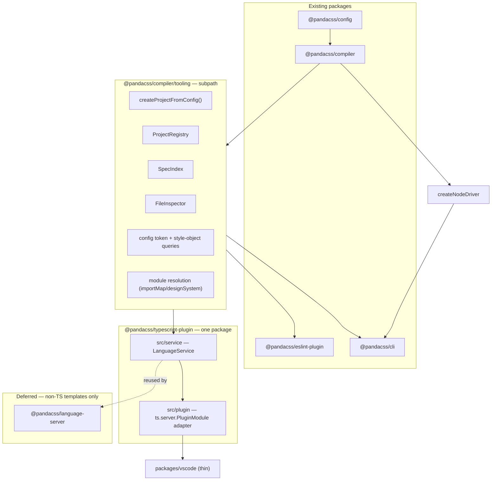

# Language service implementation

Ship editor intelligence inside the panda-v2 monorepo, **TS plugin first**:

1. **`@pandacss/compiler/tooling`** — subpath on the existing compiler package (not a new npm package)
2. **`@pandacss/typescript-plugin`** — tsserver plugin: completions, hover, diagnostics, module resolution; runs
   in-process with `tsserver`
3. **`packages/vscode`** — thin extension that registers the plugin via `contributes.typescriptServerPlugins`
   (Marketplace; not an npm library users import)
4. **`@pandacss/language-server`** — deferred. Only build if/when non-TS-native template files need coverage `tsserver`
   can't give — see [Deferred: standalone LSP](#deferred-standalone-lsp)

No `@pandacss/toolkit`. No `@pandacss/language-service`. No `@pandacss/project`.

Product rationale: [Config authoring language service](./config-authoring-language-service.md).

## Goals

- Preset-aware completions, hover, and diagnostics while editing `panda.config.ts` — token paths **and** style-object
  shapes inside `recipes`, `globalCss`, `staticCss`, `patterns`
- Module resolution for `designSystem` / `importMap` inside the editor, without generating tsconfig `paths` or bundler
  aliases
- Same token/style validation in the editor and in CI (`panda doctor`)
- Zero-config in VS Code (plugin auto-registers); documented manual `tsconfig.json` wiring for other tsserver-backed
  editors
- ESLint, the plugin, and the CLI share **`@pandacss/compiler/tooling`** — already a dependency everywhere

## Why TS plugin before LSP

`panda.config.ts` and most app files (`.ts` / `.tsx`) are plain TypeScript. `tsserver` already parses them — a plugin
walks that AST in-process for free. A standalone LSP instead means a second parser (or a Rust re-parse over NAPI)
duplicating work `tsserver` already did, a protocol layer, document-sync/debounce logic, and a full VS Code extension
that spawns and manages a server process. None of that is needed for TS-native files.

Precedent: `typescript-styled-plugin`, `ts-graphql-plugin`, and — originally — Angular's and Vue's language tooling all
started as tsserver plugins. Angular and Vue only grew a standalone LSP once non-TS-native or multi-language files
(`.vue` templates) needed it, because `tsserver`'s plugin API can't parse those at all. Panda has the same fork point:
stay a plugin as long as the files are TypeScript, add an LSP only for the files that aren't.

Practical wins from the plugin approach:

- **Auto-registration** — VS Code extensions declare `contributes.typescriptServerPlugins`, so the plugin loads with
  zero `tsconfig.json` edits. Other tsserver-backed editors add it to `compilerOptions.plugins` manually (documented,
  still no server process to manage).
- **Module resolution for free** — override `resolveModuleNameLiterals` to redirect `import { css } from '@panda/css'`
  to the resolved `designSystem` / `importMap` target, without generating tsconfig `paths`. Resolves the open question
  in [virtual-styled-system.md](./virtual-styled-system.md#unresolved-questions) about `paths` generation — the plugin
  makes it unnecessary for editor purposes (bundlers still resolve via package `exports`, unrelated to this).
- **Diagnostics ride the normal channel** — overriding `getSemanticDiagnostics` puts bad-token errors in the same
  Problems panel as real TS errors, no separate UI.

Cost to manage: the plugin runs in-process with `tsserver` — a bug or slow call degrades the user's entire TypeScript
experience, not just Panda's features. Wrap only the methods you need (proxy/decorator pattern over the base
`ts.LanguageService`), fail safe, and bound every call (cache resolved config, debounce invalidation, never block on
file I/O inside a completion request).

## Where completion logic lives: Rust vs. plugin

- **Resolved design-system data** (tokens, conditions, utilities, recipes, patterns) stays in Rust, exposed via
  `compiler.spec()`. No change from the existing architecture — this is already the right home.
- **Cursor / AST-context detection** — "is this position inside a token string? inside `recipes.button.base`? which
  utility key?" — stays in the plugin, using TypeScript's own already-parsed AST. `tsserver` parsed the file regardless
  of Panda; re-parsing it via Oxc/Rust for this would duplicate work and add FFI chatter on every keystroke, plus a
  second Oxc-vs-TS parity surface to maintain (same class of risk as the extractor's literal evaluator).

This split only holds for TS-native files. Once app-file coverage needs non-TS templates (Vue SFC, Svelte, Astro) with
no host-parsed TS AST to reuse, pushing "position → extraction context" into Rust's extractor — which already has
adapters for those frameworks — becomes the right call. See [Deferred: standalone LSP](#deferred-standalone-lsp).

## Package budget

| Surface                       | New?            | Role                                                                                                             |
| ----------------------------- | --------------- | ---------------------------------------------------------------------------------------------------------------- |
| `@pandacss/compiler/tooling`  | Subpath only    | Registry, spec index, inspect cache, config token + style-object queries, module resolution                      |
| `@pandacss/typescript-plugin` | **New package** | `LanguageService` core + `ts.server.PluginModule` adapter, ships completions/hover/diagnostics/module resolution |
| `packages/vscode`             | **New folder**  | Thin extension: `contributes.typescriptServerPlugins` registration, no server process                            |
| `@pandacss/eslint-plugin`     | Existing        | Rules; core → `compiler/tooling`                                                                                 |
| `@pandacss/cli`               | Existing        | Build → `createNodeDriver`; config check → `compiler/tooling`                                                    |
| `@pandacss/language-server`   | **Deferred**    | Only if non-TS-native template files need coverage — see below                                                   |

Everything else stays where it is today.

## Architecture

### Two lifecycles, one load primitive

| Lifecycle          | Entry                                   | Used by                                |
| ------------------ | --------------------------------------- | -------------------------------------- |
| **Build driver**   | `createNodeDriver()`                    | CLI build/watch, codegen, analyze, MCP |
| **Query registry** | `ProjectRegistry` in `compiler/tooling` | ESLint, typescript-plugin, CLI doctor  |

Both use the same helper: `loadConfig` → `createCompilerFromSnapshot` → `hydrateDesignSystem`. Extract
`createProjectFromConfig()` from `driver.ts` into `compiler/src/tooling/`; Driver and registry both call it.


```mermaid
flowchart TB
  subgraph existing [Existing packages]
    config["@pandacss/config"]
    compiler["@pandacss/compiler"]
    eslint["@pandacss/eslint-plugin"]
    cli["@pandacss/cli"]
  end

  subgraph compiler_tooling ["@pandacss/compiler/tooling — subpath"]
    load["createProjectFromConfig()"]
    registry["ProjectRegistry"]
    spec["SpecIndex"]
    inspect["FileInspector"]
    cfgq["config token + style-object queries"]
    modres["module resolution (importMap/designSystem)"]
  end

  subgraph ts_plugin ["@pandacss/typescript-plugin — one package"]
    service["src/service — LanguageService"]
    adapter["src/plugin — ts.server.PluginModule adapter"]
  end

  vscode["packages/vscode (thin)"]

  config --> compiler
  compiler --> compiler_tooling
  compiler_tooling --> eslint
  compiler_tooling --> service
  compiler_tooling --> cli
  service --> adapter
  adapter --> vscode
  compiler --> driver["createNodeDriver"]
  driver --> cli

  subgraph deferred ["Deferred — non-TS templates only"]
    lsp["@pandacss/language-server"]
  end
  service -.reused by.-> lsp
```

### Dependency rules

```txt
@pandacss/compiler/tooling     host-agnostic; no ts.server, no ESLint imports
        ↓
├─ eslint-plugin               ESLint settings → registry
├─ cli doctor                  config token/style validation
└─ typescript-plugin/service   cursor + completions (uses tooling)

typescript-plugin/plugin       ts.server.PluginModule only; no Panda logic
        ↓
packages/vscode                declares contributes.typescriptServerPlugins; no process spawning
```

**Rejected:** separate `toolkit`, `language-service`, and `project` packages — same boundaries, three extra publishes.
**Deferred:** a standalone LSP + generic `packages/vscode` server-client — see below.

### One index, one config validator

- **SpecIndex** — from `compiler.spec()`; shared by eslint rules and completions
- **Config queries** — in `compiler/tooling`; typescript-plugin and CLI doctor import the same functions for both
  token-path strings and style-object shapes (`recipes`, `globalCss`, `staticCss`, `patterns`)

App-file tokens stay on `compiler.inspectFile` → `tokenRefs` (eslint). The typescript-plugin reuses the same
`FileInspector` once it extends to app files (see Phased rollout).

## `@pandacss/compiler/tooling`

Subpath export on the existing compiler package. ESLint and CLI already depend on `@pandacss/compiler`; no new
transitive dependency for them.

```txt
packages/compiler/src/tooling/
  create-project.ts        shared with driver.ts
  registry.ts              ProjectRegistry
  spec-index.ts            SpecIndex from compiler.spec()
  inspector.ts             FileInspector (from eslint-plugin)
  config-tokens.ts         find/complete/validate {token.path} in config text
  config-style-object.ts   complete utility keys/values + condition keys inside recipes/globalCss/staticCss/patterns
  module-resolution.ts     resolve designSystem/importMap targets for a given import specifier
  resolve.ts               discover configs, map file → config
```

**`package.json` export:**

```json
"./tooling": {
  "source": "./src/tooling/index.ts",
  "types": "./dist/tooling/index.d.ts",
  "default": "./dist/tooling/index.js"
}
```

Add `src/tooling/index.ts` to the compiler `tsup` build entry.

### `ProjectRegistry`

Replaces eslint-plugin `ProjectCache`. Backs typescript-plugin workspace handling.

```ts
interface ProjectRegistry {
  discover(workspaceRoot: string): Promise<string[]>
  resolveConfigForFile(filePath: string): string | undefined
  getProject(key: { cwd: string; configPath?: string }): Promise<PandaProject>
  invalidate(changedPaths: string[]): void
}
```

Discovery/matching: same rules as [lint-plugins](./lint-plugins.md). Cache by `(cwd, configPath)`. Debounce invalidation
(~300ms).

### Config queries

```ts
function findConfigTokenRefs(source: string, spec: SpecIndex): ConfigTokenRef[]
function completeConfigTokenPath(prefix: string, spec: SpecIndex): string[]
function completeConfigStyleObject(node: StyleObjectContext, spec: SpecIndex): CompletionEntry[]
function resolveModuleTarget(specifier: string, importMap: ImportMapOutput): string | undefined
```

`completeConfigStyleObject` covers `recipes.*.base`, `recipes.*.variants.*`, `globalCss`, `staticCss`, and
`patterns.*.properties` — the same utility-key/condition-key/token-value completion app files need, just pointed at
config-embedded object literals instead. No TypeScript typechecker involved — string/AST scan around cursor spans, using
positions the plugin already has from `tsserver`'s parse.

## `@pandacss/typescript-plugin`

One package, two layers inside it:

| Layer              | Path           | Depends on                        |
| ------------------ | -------------- | --------------------------------- |
| **Service**        | `src/service/` | `@pandacss/compiler/tooling` only |
| **Plugin adapter** | `src/plugin/`  | service + `typescript` (peer dep) |

```txt
packages/typescript-plugin/
  src/service/     LanguageService — completions, diagnostics, hover, definition, module resolution
  src/plugin/      ts.server.PluginModule — proxy/decorator over the base LanguageService
  index.ts         plugin entry point (what tsserver loads)
```

**Service API** (no `typescript` server types):

```ts
interface LanguageService {
  getCompletions(input: DocumentQuery): CompletionItem[]
  getDiagnostics(input: DocumentQuery): Diagnostic[]
  getHover(input: DocumentQuery): Hover | null
  getDefinition(input: DocumentQuery): Location | null
  resolveModule(specifier: string, containingFile: string): ResolvedModule | undefined
}
```

**Plugin adapter** wraps only:

- `getCompletionsAtPosition` / `getCompletionEntryDetails` — merge Panda completions into TS's own list
- `getQuickInfoAtPosition` — hover
- `getSemanticDiagnostics` — bad token/style-object diagnostics, same channel as TS errors
- `resolveModuleNameLiterals` — redirect `designSystem`/`importMap` specifiers

Every other method delegates untouched to the base language service (proxy pattern) — minimizes blast radius if Panda's
logic throws or is slow.

**Routing:**

1. `ProjectRegistry.resolveConfigForFile(file)`
2. Config file → `tooling/config-tokens` + `tooling/config-style-object` + `SpecIndex`
3. App file (later phase) → `FileInspector` + `suggestTokens`

**Optional export** `@pandacss/typescript-plugin/service` for tests or reuse by a future LSP adapter — same code the
plugin runs.

## `packages/vscode` (thin)

`panda-css-vscode` on Marketplace. In the plugin-first world this is deliberately small:

- `package.json` →
  `contributes.typescriptServerPlugins: [{ name: '@pandacss/typescript-plugin', enableForWorkspaceTypeScriptVersions: true }]`
- Bundles `@pandacss/typescript-plugin` as a dependency so VS Code's built-in TS extension can load it
- No process spawning, no LSP client, no capability negotiation
- Optional polish: workspace trust gating, color decorators via extension APIs (not `documentColor` — that's LSP-only)

This ships alongside the plugin (Phase 1/2), not deferred — it's the only way VS Code users get zero-config setup.

## Deferred: standalone LSP

Do not build `@pandacss/language-server` yet. Build it only when a concrete file type forces it: non-TS-native templates
(Vue SFC, Svelte, Astro) where `tsserver` has no parse to reuse at all.

Before building it:

- Check real demand — issues/upvotes on the old `panda-vscode` repo asking for Neovim/Helix/non-VS-Code support, or for
  non-React framework template completions. If thin, the plugin-only path may cover the project for a long time.
- If built, prefer integrating with the frameworks' **existing** language tooling (Volar for Vue,
  `svelte-language-server`, Astro's language server) rather than shipping a second, competing generic LSP for the same
  files — those already solve TS-interop inside non-TS templates; Panda only needs to plug completions into them.
- Reuse `src/service` from `@pandacss/typescript-plugin` unchanged — only the transport is new (`src/lsp` wrapping
  `vscode-languageserver`, mapping service types ↔ LSP types, no Panda logic in that layer).
- This is also the point where pushing "position → extraction context" into Rust's extractor becomes justified — those
  frameworks' adapters already exist in `pandacss_extractor` and there's no host-parsed TS AST to reuse instead.

## CI parity

| Surface                    | Config invalid `{colors.x}` | Config invalid style-object key/value | App invalid token |
| -------------------------- | --------------------------- | ------------------------------------- | ----------------- |
| Editor (typescript-plugin) | Warning (configurable)      | Warning (configurable)                | Later phase       |
| `panda doctor`             | Error                       | Error                                 | N/A               |
| `@pandacss/eslint-plugin`  | N/A initially               | N/A initially                         | Error / warn      |

Validation logic: **`@pandacss/compiler/tooling`** only. Severity differs by host.

## Phased rollout

### Phase 0 — `compiler/tooling`

- [ ] `packages/compiler/src/tooling/` + `./tooling` export
- [ ] `createProjectFromConfig` — refactor out of `driver.ts`
- [ ] `ProjectRegistry`, `SpecIndex`, `FileInspector`
- [ ] Refactor eslint-plugin to import from `@pandacss/compiler/tooling`
- [ ] Vitest in `packages/compiler` for tooling

**Done when:** eslint-plugin tests unchanged; registry resolves preset tokens from a fixture config.

### Phase 1 — TS plugin: config completions

- [ ] `config-tokens.ts` + `config-style-object.ts` + `module-resolution.ts` in tooling
- [ ] `@pandacss/typescript-plugin` — service + `ts.server.PluginModule` adapter
- [ ] CLI `doctor` uses tooling for the same token/style-object validation

**Done when:** the plugin completes `colors.red.500` in a token string **and** `color`/`_hover` keys inside
`recipes.*.base` / `globalCss` / `staticCss`, without generated types, inside real `tsserver`.

### Phase 2 — VS Code (thin) + npm

- [ ] `packages/vscode` — `contributes.typescriptServerPlugins` registration only
- [ ] Publish `@pandacss/typescript-plugin` to npm
- [ ] Deprecate standalone `panda-vscode` repo
- [ ] Document manual `compilerOptions.plugins` wiring for other tsserver-backed editors

**Done when:** installing the VS Code extension gives config completions with zero `tsconfig.json` edits.

### Phase 3 — App files (still TS-native)

- [ ] Plugin routes `.ts`/`.tsx` app files through `FileInspector` + `suggestTokens`
- [ ] Module resolution override extended to app-file imports

### Phase 4 — Non-TS templates (deferred, demand-gated)

- [ ] Confirm demand before starting
- [ ] `@pandacss/language-server` — reuse `typescript-plugin/service`, add `src/lsp` transport
- [ ] Integrate with Volar / `svelte-language-server` / Astro LS rather than a standalone generic client

### Phase 5 — Optional

- [ ] buildinfo in SpecIndex
- [ ] Inlay hints
- [ ] tsserver plugin ↔ LSP dedupe if both ever run in the same editor

## Testing

| Layer          | Where                                                                            |
| -------------- | -------------------------------------------------------------------------------- |
| Tooling        | `packages/compiler` Vitest                                                       |
| ESLint         | `packages/eslint-plugin` (unchanged assertions)                                  |
| Service        | `packages/typescript-plugin` Vitest (no `ts.server` types)                       |
| Plugin adapter | `packages/typescript-plugin` integration harness against a real `ts.server` host |
| VS Code        | `@vscode/test-electron` smoke (plugin registration only)                         |
| CLI            | doctor fails on bad config token / style-object key                              |

## Open questions

- Config typo severity in editor: warning vs error
- How much of app-file completion (Phase 3) ships before non-TS templates (Phase 4) are requested
- Whether `panda.buildinfo.json` feeds the plugin's index for design-system packages
- Version skew: plugin API surface must tolerate the range of TypeScript versions users select as their workspace
  version

## Related

- [Config authoring language service](./config-authoring-language-service.md)
- [Virtual styled-system](./virtual-styled-system.md) — module resolution target for `designSystem`/`importMap`
- [Panda lint plugins](./lint-plugins.md)
- [Config loading](./config-loading-design.md)
- [CLI v2 direction](./cli.md)
- [Output and host layer](./output-and-host-layer.md)
