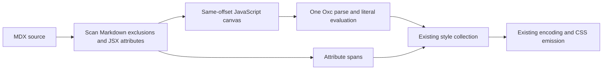

# MDX extraction

Panda previously sent raw `.mdx` documents to Oxc as TSX, so Markdown could prevent live styles from being extracted.
This prototype addresses [issue #3948](https://github.com/chakra-ui/panda/issues/3948) through the existing container
adapter in `pandacss_sfc`. Files already covered by `include` require no additional configuration.

## Ownership

| Module              | Responsibility                                                                        |
| ------------------- | ------------------------------------------------------------------------------------- |
| `mdx.rs`            | Scan the document in source order; collect tags, attributes, and diagnostics          |
| `mdx/markdown.rs`   | Skip Markdown examples and destinations; own inline-code/image caches and line lookup |
| `mdx/javascript.rs` | Find JavaScript island boundaries with the shared lexer; leave validation to Oxc      |
| `mdx/canvas.rs`     | Build same-offset JavaScript; own synthetic array and module separators               |

The canvas has one tail state: empty, expression array, or module declaration. It closes an array before copying a
module and separates a module from the next array. The scanner cannot independently mutate that punctuation or hold
conflicting array/module state.

## Extraction contract

The adapter retains module imports/exports, JavaScript expressions, and component opening-tag attributes. Existing
import matching, literal evaluation, JSX rules, encoding, and CSS generation then apply. Fenced and inline code,
frontmatter, escapes, and link destinations are excluded. Code examples must never emit styles.

Byte offsets stay tied to the original source, including UTF-8 and CRLF. Expressions become entries in a synthetic
array, avoiding extra scopes and preserving identifier lookup. Arrays split around module declarations. A separator
after a semicolonless export uses an existing blank byte; in the tightest case it replaces a newline. Diagnostics
therefore resolve their line/column against the original document rather than the canvas.

Opening tags use the existing Astro attribute-span representation, exported under container-neutral aliases. Embedded
JSX inside JavaScript remains JSX for Oxc. Attribute expressions use the shared parse's literal cache. A missing or
dynamic value never triggers a second parse of the document. Quoted attributes decode XML/numeric entities using Oxc's
existing entity table.

MDX source rewriting deliberately bails with the source unchanged. Rewriting synthetic arrays back into an MDX document
needs a separate contract and tests; extraction and CSS generation do not depend on it.

## Cost and design choice

An initial full Markdown AST prototype used `markdown-rs` and embedded-JavaScript validation callbacks. It passed the
initial extraction tests, but allocating a Markdown tree and repeatedly parsing expressions cost substantially more time
and memory than TSX. The final adapter adds no runtime dependency and performs no JavaScript parsing itself.

The scanner stores source spans, its canvas, and open-tag state. Inline backtick runs are indexed lazily on the first
inline-code encounter; common delimiter lengths use a small array. Failed image-label searches are cached and tag
lookahead is bounded to avoid repeated suffix scans. Multiline exports reuse the shared JavaScript lexer and brace
matcher. Normal `.ts`/`.tsx` sources continue through their existing path.

Tag line lookup advances through previously unread bytes rather than searching the same paragraph backwards for every
tag. Dense single-line JSX is included in the benchmark to guard this path.

See the [benchmark report](./bench/mdx-3948.md) for measured latency, allocations, watch behavior, and acceptance gates.
These gates are local regression criteria, not universal latency guarantees.

## Validation and remaining scope

The inline boundary snapshots in `crates/pandacss_sfc/tests/mdx/` record the named JSX elements and JavaScript
call spans reported by `@mdx-js/mdx` 3.1.1. Each test keeps its source beside its expected output; cases are grouped
by JSX, expressions, Markdown exclusions, modules, mixed documents, and byte offsets. The original 101-case corpus
contained 32 duplicate documents; all 69 distinct cases remain covered. The 151 repository MDX documents also matched
the official parser in the initial local check. Extraction tests cover static/dynamic attributes, spreads, imports,
exports, comments, entities, diagnostics, and original offsets; compiler tests cover CSS generation and watch replacement.

This is an extraction adapter, not a complete MDX validator or compiler. It does not execute remark/rehype plugins or
custom syntax transformations. Parity is checked for extraction boundaries rather than every Markdown AST node.

**Known over-extraction limitation:** reference-style images do not resolve their labels, so JSX in their alt text can be
extracted as a live component. For example, `![<Box color="wrong" />][image]` followed by `[image]: /asset.png`
currently extracts `wrong`; the official parser treats the label as image text. Correct handling needs document-wide
definition resolution, including definitions outside code examples and forward references. Keep that responsibility in
the Markdown layer rather than teaching the style collector about image syntax.

Follow up with reference-image resolution and broader third-party corpus, entity, and plugin-transformed syntax coverage.
Existing CSS output snapshots must remain unchanged.

## Related

- [Extraction pipeline](./extraction-pipeline.md)
- [Astro parser](./astro-parser.md)
- [Literal evaluator](./literal-evaluator.md)
- [Project lifecycle](./project-lifecycle.md)
