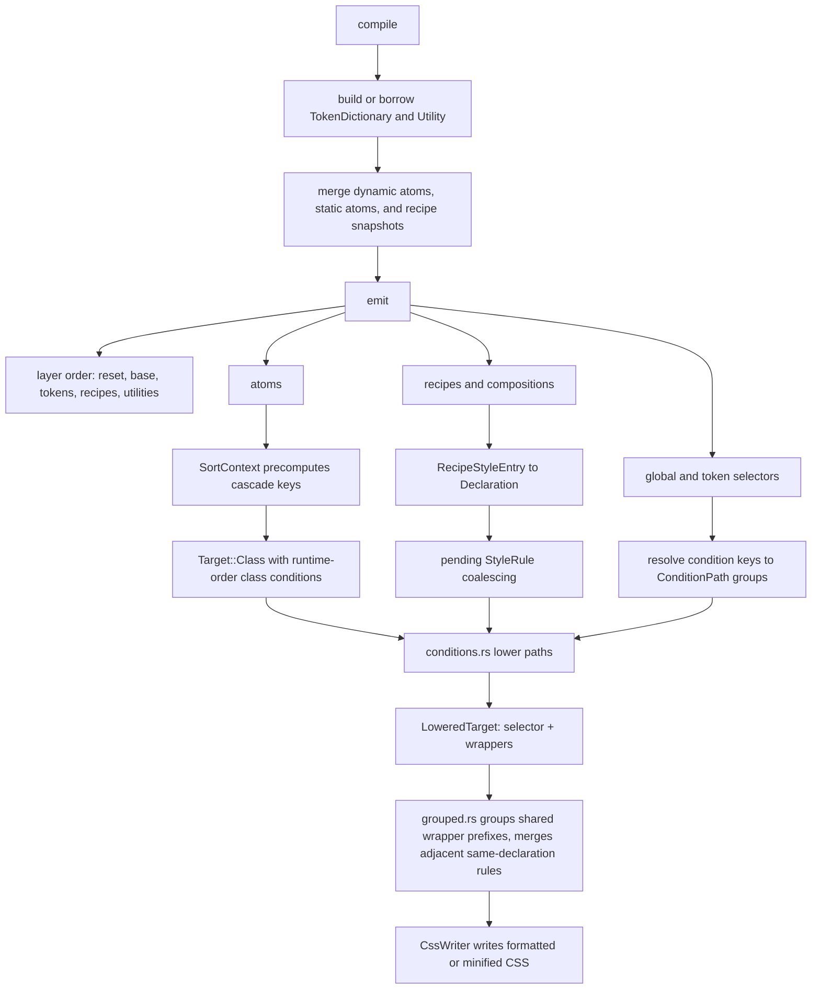

# Native Stylesheet Compiler

## Summary

`pandacss_stylesheet` emits native CSS from resolved config, borrowed atoms, token data, and encoded recipes. It owns CSS
emission, supported static CSS expansion, layer slicing metadata, and writer formatting. It runs one CSS-aware pass at
the IR level — adjacent rules sharing a declaration block are coalesced into a selector list (`grouped.rs`) — but no full
optimizer (no parsing, prefixing, shorthand folding, or value minification); if those land, they belong in a CSS-aware
optimizer such as `lightningcss`, not a raw whitespace pass.

## Scope

Owned:

- Reset/preflight emission, including `preflight.scope` and `preflight.level`.
- Base layer config CSS: `globalCss`, `globalVars`, `globalFontface`, and `globalPositionTry`.
- Tokens layer: token CSS variables, semantic-token conditions, and `theme.keyframes`.
- Recipes layer: config recipes, slot recipes, compound variants, and split recipe files.
- Utilities layer: dynamic atoms, recipe atomic atoms, static atoms, and utility sub-layers.
- Supported native `staticCss`: `css`, `recipes`, global recipe wildcard, recipe-level `staticCss`, recipe wildcards,
  base recipe styles, slot recipes, compound variants, responsive values, and configured conditions.
- Layer preamble/ranges, custom layer names, modern breakpoint media syntax, and writer-level minification.
- Adjacent rule merging: consecutive rules with an identical declaration block collapse into one comma-joined selector
  list (cascade-safe, adjacency-only — mirrors lightningcss's `CssRuleList::minify`).

Not owned:

- Theme artifact/codegen files.
- `staticCss.patterns` beyond diagnostics for unsupported native paths.
- `preflight.scope`/`level` rewriting.
- CSS parsing, prefixing, shorthand folding, AST/value minification, or incremental watch-mode patching.

`globalVars` emits regular CSS variables. Object values become `@property` registrations only when the resulting CSS
would be valid: `syntax` and `inherits` are required, and `initialValue` is required unless `syntax` is `"*"`.

## Internal Model

The durable private concepts are intentionally few:

- `Target`: rule identity before condition lowering, either a Panda class target or an explicit selector.
- `ConditionPath`: one raw condition chain, ordered outer-to-inner.
- `Declaration`: one CSS property/value/important tuple.
- `StyleRule`: one lowered target plus declarations, used for coalescing and writing.

`LoweredTarget` is an implementation detail: selector plus at-rule wrappers after condition lowering. It should not grow
into a separate public stylesheet concept.

## Flow

The key invariant is that class names and CSS ordering are separate. Class-target conditions preserve source/runtime
order so selectors match recipe runtime output. Rule conditions are sorted separately for cascade before lowering.

## Ordering

`sort.rs` owns final cascade order. It sorts by:

1. Rule bucket: base, selector-only, then at-rule/mixed variants.
2. At-rule priority: supports, media, container, print, then other at-rules; size queries sort by resolved length and
   direction across every axis — `width`, `inline-size` (container queries), `height`, and `block-size`.
3. Selector priority: pseudo selectors use the configured pseudo-class priority table.
4. Property priority: broad shorthands before shorthand groups before longhands.
5. Deterministic ties: property name, atom value key, rule conditions, then class conditions.

Condition application is separate from sorting. At-rules become wrappers, `&` conditions rewrite selectors, plain
selectors become ancestors, and pseudo-elements are emitted after pseudo-classes so selectors stay valid.

## Performance

- `Project.compile()` passes borrowed atoms into stylesheet compilation; generated static atoms live in a local buffer.
- `TokenDictionary` and `Utility` are built once per compile and shared by static expansion and emission.
- Sort keys are precomputed once per atom or recipe entry, avoiding allocation inside the comparator.
- Empty static recipe snapshots skip `merge_encoded_recipes()`.
- Current emit cost is `O(total atoms log total atoms)`. Incremental watch-mode CSS patching would require a different
  API with per-bucket output and stable invalidation.

## Output Modes

- **Merged**: `compile()` returns one CSS string plus UTF-8 byte ranges for reset/base/tokens/recipes/utilities. Layer
  slicing must happen in Rust, not JS, because JS string indices are UTF-16.
- **Split**: `split_css()` returns file artifacts. Non-recipe layers split by file; recipes are re-emitted per recipe
  name because the merged recipes layer is not byte-sliceable into recipe files.

Only the five top-level layers are sliceable today. Keyframes/static output share layers and would need sub-ranges to
split independently.

## Related

- [Compiler lifecycle](./compiler-lifecycle.md)
- [Atomic encoding](./atomic-encoding.md)
- [Crate layering](./crate-layering.md)
- [Scope and boundaries](./scope-and-boundaries.md)
